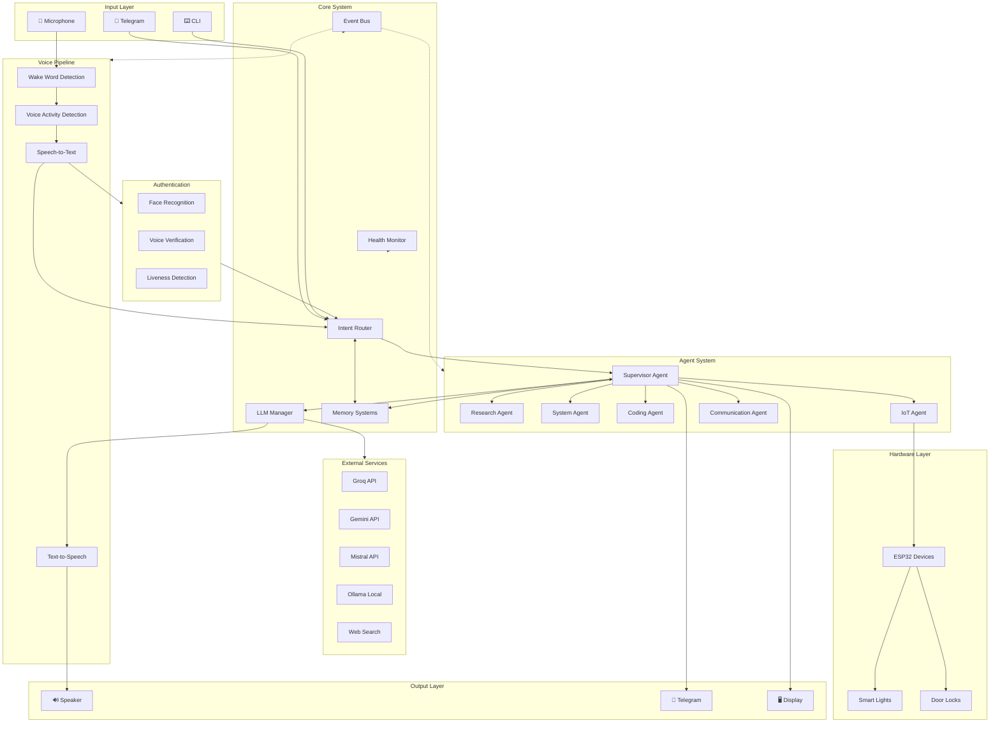
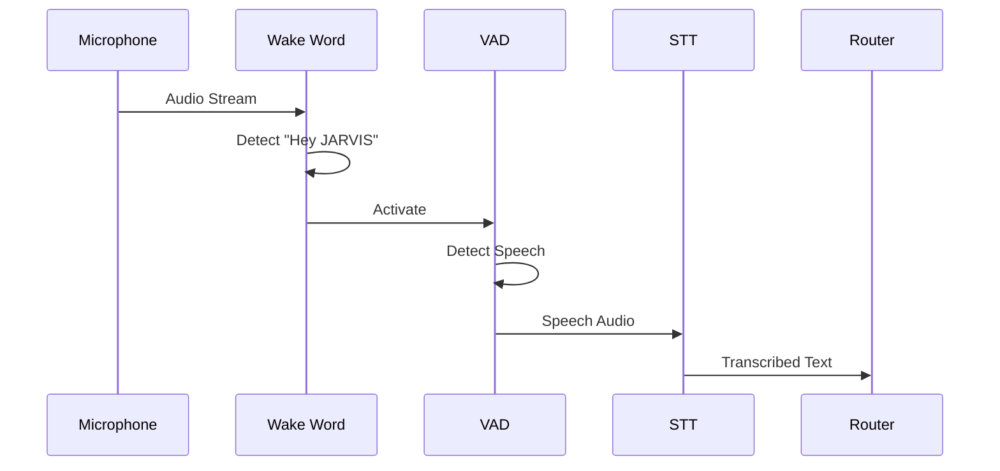
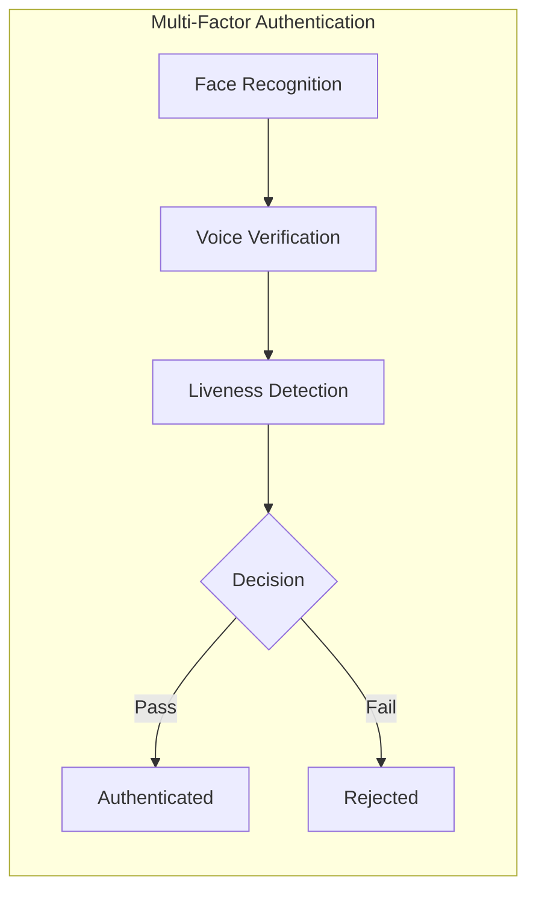
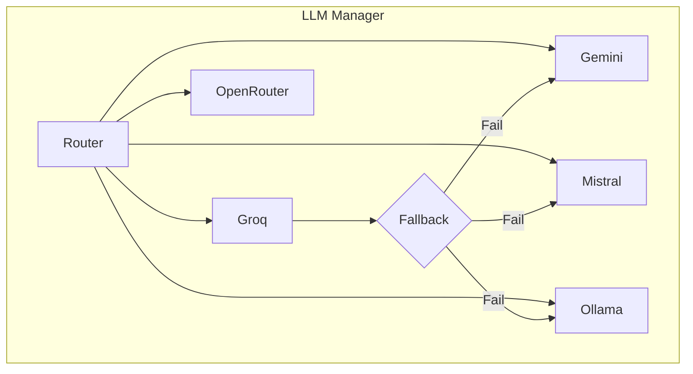
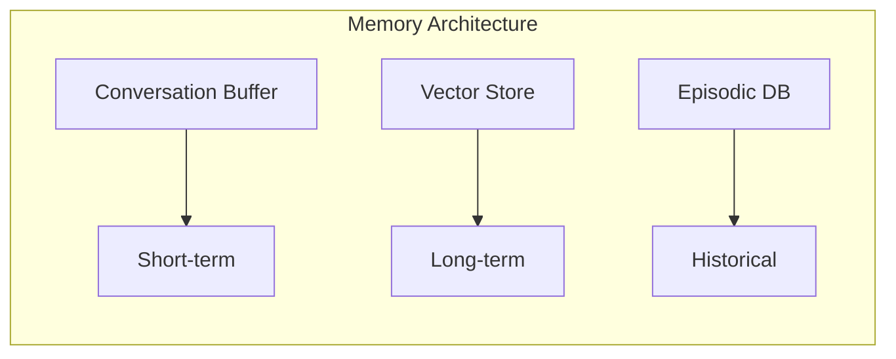
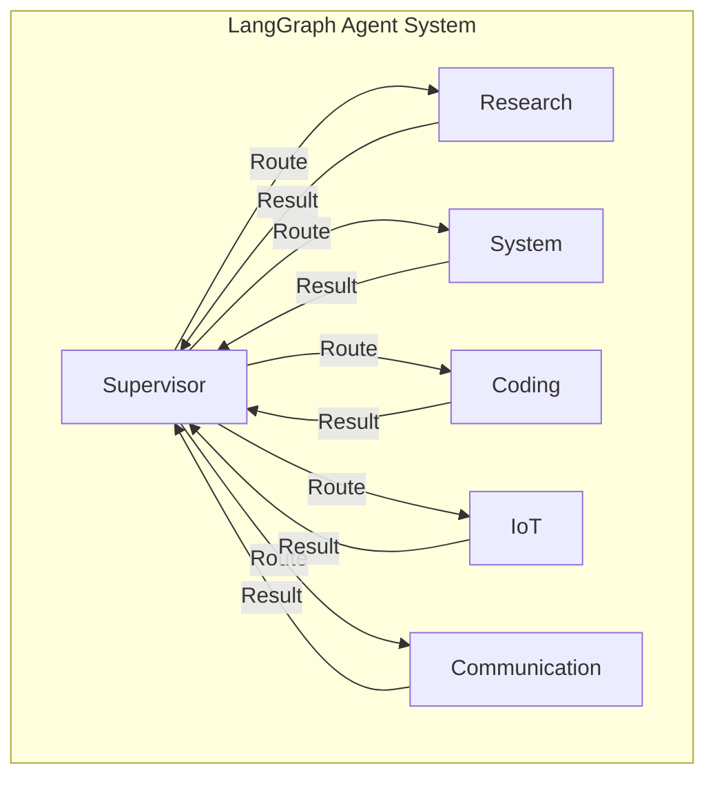
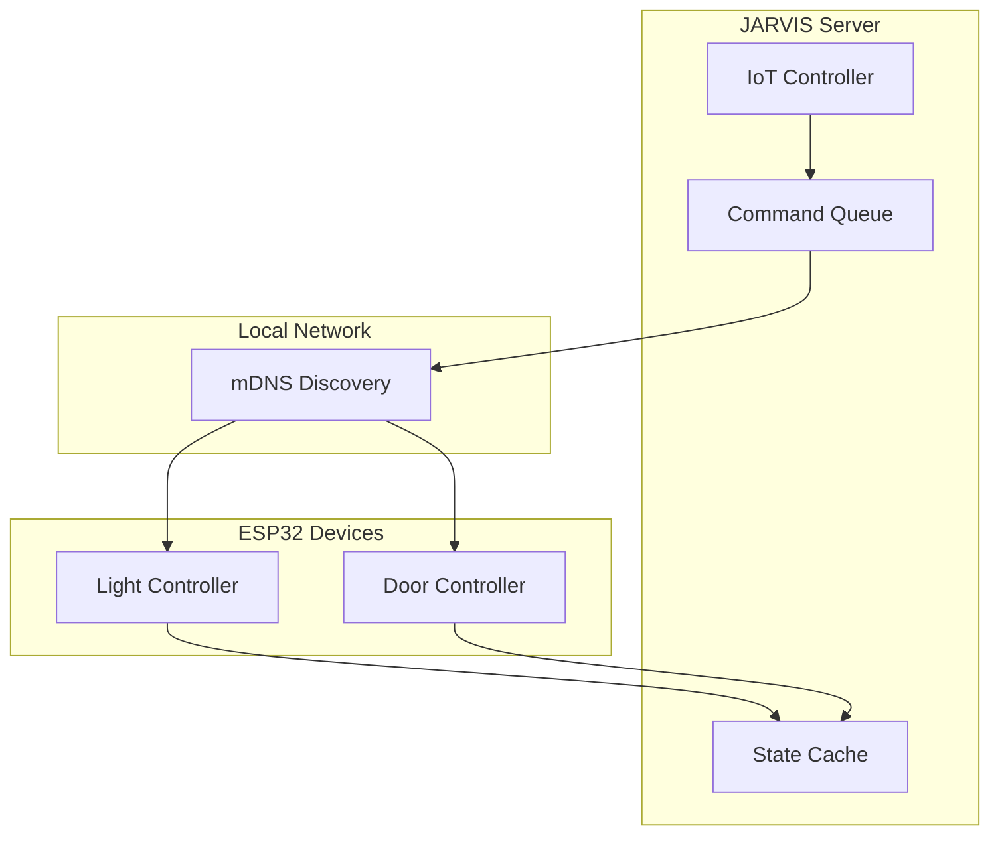
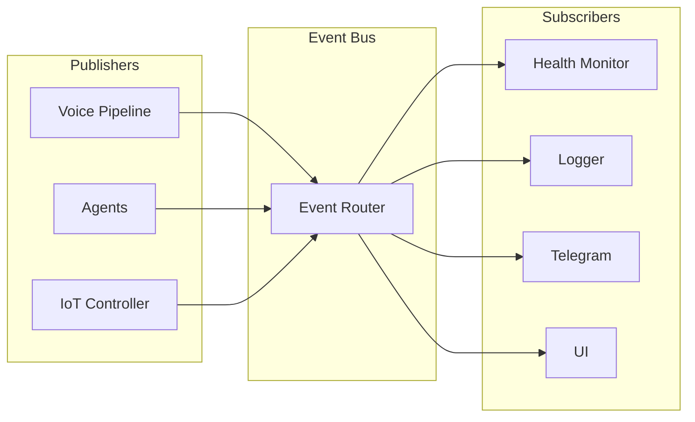
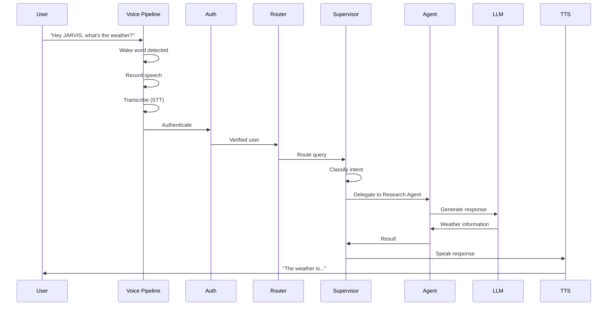
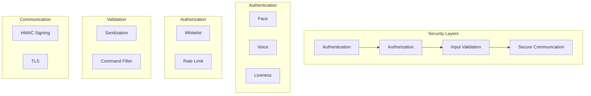

# JARVIS Architecture

This document provides a comprehensive overview of the JARVIS AI assistant architecture.

## System Overview



## Component Details

### 1. Input Layer

| Component | Description | Location |
|-----------|-------------|----------|
| Microphone | Audio input for voice commands | Hardware |
| Telegram | Remote command interface | `src/telegram/` |
| CLI | Text-based command interface | `run.py --text` |

### 2. Voice Pipeline



| Component | Technology | File |
|-----------|------------|------|
| Wake Word | Porcupine/Custom | `src/voice/wake_word_enhanced.py` |
| VAD | Silero VAD | `src/voice/stt_enhanced.py` |
| STT | Whisper/Groq | `src/voice/stt_enhanced.py` |
| TTS | Edge TTS/pyttsx3 | `src/voice/tts.py` |

### 3. Authentication System



| Component | Technology | File |
|-----------|------------|------|
| Face Recognition | face_recognition | `src/auth/face_recognition.py` |
| Voice Verification | Speaker embedding | `src/auth/voice_auth.py` |
| Liveness Detection | Motion analysis | `src/auth/liveness.py` |

### 4. Core System

#### LLM Manager



| Provider | Use Case | Speed | Cost |
|----------|----------|-------|------|
| Groq | Fast queries | ⚡ Fast | Free tier |
| Gemini | Complex reasoning | Medium | Free tier |
| Mistral | Code generation | Medium | Free tier |
| Ollama | Offline/Privacy | Slow | Free |

#### Memory Systems



| Type | Technology | Purpose |
|------|------------|---------|
| Conversation | In-memory buffer | Recent context |
| Vector | ChromaDB | Semantic search |
| Episodic | SQLite | Historical events |

### 5. Agent System



| Agent | Capabilities | Tools |
|-------|--------------|-------|
| Research | Web search, summarization | Tavily, Wikipedia |
| System | App control, screenshots | pyautogui, subprocess |
| Coding | Code generation, Git | VS Code, Git CLI |
| IoT | Device control | ESP32 HTTP API |
| Communication | Email, messaging | SMTP, Telegram |

### 6. IoT Architecture



#### ESP32 Firmware Stack

```
┌─────────────────────────────────────┐
│           main.py                   │
│    (HTTP Server & Routes)           │
├─────────────────────────────────────┤
│  wifi_manager  │  http_server       │
│  auth          │  servo_control     │
│  led_status    │  mdns_service      │
│  storage       │  logger            │
├─────────────────────────────────────┤
│         MicroPython                 │
├─────────────────────────────────────┤
│           ESP32                     │
└─────────────────────────────────────┘
```

### 7. Event Bus



#### Event Types

| Event | Payload | Triggered By |
|-------|---------|--------------|
| `wake_word_detected` | `{confidence}` | Voice Pipeline |
| `command_received` | `{text, source}` | Voice/Telegram |
| `agent_started` | `{agent, query}` | Supervisor |
| `agent_completed` | `{agent, result}` | Agent |
| `device_state_changed` | `{device_id, state}` | IoT Controller |
| `health_check` | `{component, status}` | Health Monitor |

### 8. Data Flow



## Directory Structure

```
jarvis/
├── config/
│   └── settings.yaml       # Main configuration
├── data/
│   ├── logs/              # Application logs
│   ├── memory/            # Persistent memory
│   └── benchmarks/        # Performance data
├── docs/
│   ├── ARCHITECTURE.md    # This file
│   ├── USER_GUIDE.md      # User documentation
│   ├── DEVELOPER_GUIDE.md # Developer documentation
│   └── HARDWARE_SETUP.md  # Hardware guide
├── firmware/
│   └── esp32/             # ESP32 MicroPython firmware
├── scripts/
│   ├── preflight_check.py # System validation
│   ├── benchmark.py       # Performance testing
│   └── service/           # Service installation
├── src/
│   ├── agents/            # LangGraph agents
│   ├── auth/              # Authentication
│   ├── core/              # Core systems
│   ├── iot/               # IoT controller
│   ├── memory/            # Memory systems
│   ├── proactive/         # Proactive features
│   ├── system/            # System control
│   ├── telegram/          # Telegram bot
│   ├── voice/             # Voice pipeline
│   └── jarvis_unified.py  # Main application
├── tests/
│   ├── unit/              # Unit tests
│   └── integration/       # Integration tests
├── run.py                 # Entry point
└── requirements.txt       # Dependencies
```

## Configuration

### Environment Variables (.env)

```bash
# LLM Providers
GROQ_API_KEY=gsk_...
GEMINI_API_KEY=...
MISTRAL_API_KEY=...
OPENAI_API_KEY=sk-...

# Telegram
TELEGRAM_BOT_TOKEN=...
TELEGRAM_ALLOWED_USERS=123456789

# IoT
IOT_SHARED_SECRET=your_secret_here

# Optional
TAVILY_API_KEY=...
```

### Settings (config/settings.yaml)

```yaml
jarvis:
  name: "JARVIS"
  wake_word: "hey jarvis"
  
voice:
  stt_provider: "groq"
  tts_provider: "edge"
  vad_threshold: 0.5
  
llm:
  default_provider: "groq"
  fallback_providers: ["gemini", "ollama"]
  
agents:
  enabled: ["research", "system", "coding", "iot"]
```

## Security Model



## Performance Targets

| Metric | Target | Measured |
|--------|--------|----------|
| Wake word latency | < 100ms | TBD |
| STT latency | < 1000ms | TBD |
| LLM response (simple) | < 2000ms | TBD |
| End-to-end (simple) | < 3000ms | TBD |
| End-to-end (complex) | < 8000ms | TBD |

## Scaling Considerations

### Current Limitations
- Single-user design
- Local network IoT only
- No distributed processing

### Future Enhancements
- Multi-user support with profiles
- Cloud IoT integration
- Distributed agent execution
- Mobile app integration

## Related Documentation

- [User Guide](USER_GUIDE.md) - End-user documentation
- [Developer Guide](DEVELOPER_GUIDE.md) - Development documentation
- [Hardware Setup](HARDWARE_SETUP.md) - IoT hardware guide
- [API Reference](API_REFERENCE.md) - Internal API documentation
